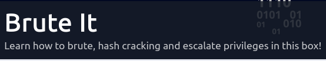

# Writeups

The writeups I created so far.  I'm currently working on a workflow to publish my notes automatically on a Github Pages.

When this will be working, I will share the link here.

TODO:
[ ] Find a working workflow.
[ ] Add Link.

---

## Tryhackme.com

### Brute It

---

Tags: hydra, ssh2john, john, sudo, unshadow  

---

[Brute It](./brute-it/brute-it.md)

---

### Crack the hash

---

Tags: hashes.com, CyberChef, Cracking-station.net, hashcat  

---

[Crack the hash](./crack-the-hash/crack-the-hash.md)

---
